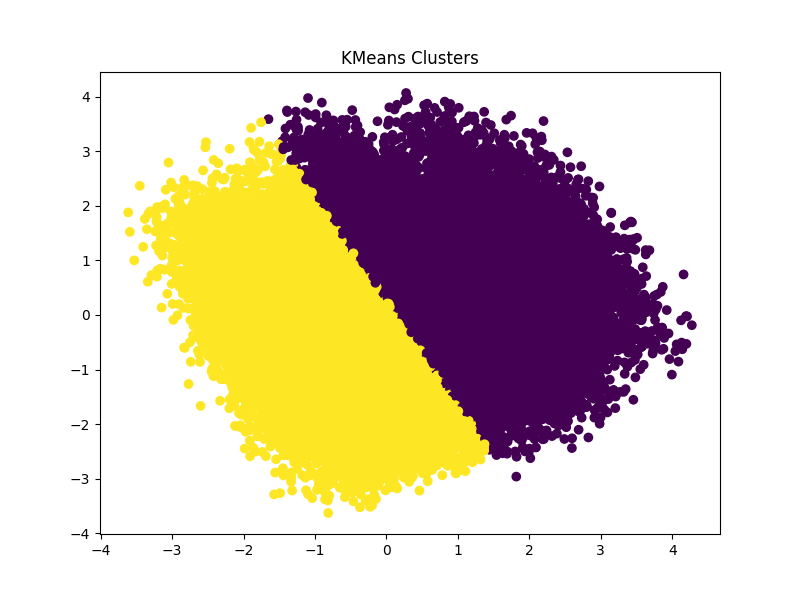
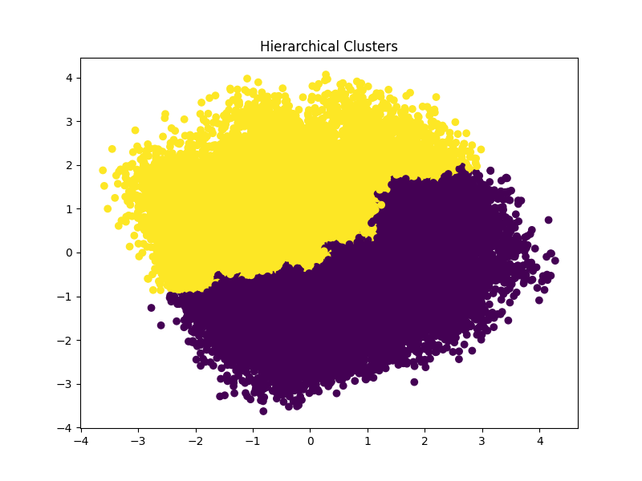
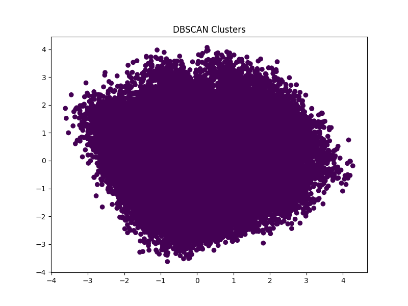

# 🚀 Customer Segmentation using Unsupervised Machine Learning

# 📌 Project Overview
Customer segmentation is a critical task in modern data-driven businesses. This project applies advanced **unsupervised machine learning techniques** to segment customers based on demographic and behavioral attributes.

The goal is to uncover hidden patterns in customer data and generate **actionable business insights** that improve marketing strategies, customer retention, and revenue generation.

---

# 🎯 Problem Statement
Organizations often struggle to understand diverse customer behaviors. Without proper segmentation:
- Marketing efforts become inefficient  
- High-value customers are not targeted effectively  
- Potential churn customers are overlooked  

This project solves the problem by:
✔ Identifying meaningful customer segments  
✔ Enabling personalized marketing strategies  
✔ Supporting data-driven business decisions  

---

# 📊 Dataset Description
The dataset includes the following attributes:

- Customer ID  
- Age  
- Gender  
- Education Level  
- Geographic Information  
- Occupation  
- Income Level  
- Customer Service Interactions  
- Insurance Products Owned  
- Preferred Contact Time  
- Preferred Language  
- Segmentation Group


These features help analyze both **financial capacity and behavioral patterns** of customers.

---

# ⚙️ Complete Machine Learning Lifecycle

## 1️⃣ Data Preprocessing
- Handling missing values  
- Encoding categorical variables  
- Feature scaling (Standardization)  
- Data cleaning  

---

## 2️⃣ Exploratory Data Analysis (EDA)
- Univariate, bivariate, and multivariate analysis  
- Distribution plots  
- Correlation heatmaps  
- Pattern discovery before modeling  

---

## 3️⃣ Feature Engineering
- Creation of derived features  
- Behavioral pattern extraction  
- Data transformation for improved clustering  

---

## 4️⃣ Clustering Algorithms Implemented
The project includes multiple unsupervised learning techniques:

- ✅ K-Means Clustering  
- ✅ Hierarchical Clustering  
- ✅ DBSCAN  
- ✅ Gaussian Mixture Model (GMM)  

# ⚙️ Algorithms Used

## 🔹 K-Means Clustering
K-Means is a centroid-based clustering algorithm that partitions data into K clusters by minimizing the distance between data points and their respective cluster centroids.

- Efficient and scalable
- Works well for large datasets
- Selected as the best model in this project

---

## 🔹 Hierarchical Clustering
Hierarchical clustering builds a tree-like structure (dendrogram) by merging or splitting clusters based on distance.

- Does not require pre-specifying number of clusters
- Useful for understanding data hierarchy

---

## 🔹 DBSCAN (Density-Based Spatial Clustering)
DBSCAN groups data points based on density and identifies noise points.

- Can detect outliers
- Does not require number of clusters beforehand
- Performance depends on parameter tuning

---

## 🔹 Gaussian Mixture Model (GMM)
GMM assumes data is generated from a mixture of Gaussian distributions.

- Probabilistic clustering approach
- More flexible than K-Means
- Handles overlapping clusters better

# 📊 Sample Visualizations

## 🔹 K-Means Clustering


---

## 🔹 Hierarchical Clustering


---

## 🔹 DBSCAN Clustering


---

---

## 5️⃣ Optimal Cluster Selection
Scientific evaluation methods used:
- Elbow Method  
- Silhouette Score  
- Davies-Bouldin Index  

👉 **Final decision:** K = 2 clusters (based on performance and interpretability)

---

## 6️⃣ Dimensionality Reduction
- Principal Component Analysis (PCA)  
- Reduced high-dimensional data into 2D  
- Enabled clear visualization of clusters  

---

## 7️⃣ Model Comparison
Models were evaluated using Silhouette Score:

|    Model     |      Performance     |
|--------------|----------------------|
|    KMeans    |         Best         |
|     GMM      |       Comparable     |
| Hierarchical |     Slightly lower   |
|    DBSCAN    | Failed (noise-heavy) |

👉 **Final Selected Model: K-Means Clustering**

---

# 📈 Results & Customer Segments

## 🟢 Cluster 0 – High-Value Customers
- High income  
- Stable behavior  
- Major contributors to revenue  

👉 Strategy: Premium services, loyalty programs  

---

## 🔴 Cluster 1 – At-Risk Customers
- Low engagement  
- Low income  
- High churn probability  

👉 Strategy: Retention campaigns, discounts  

---

## 🔵 Cluster 2 – Active Customers
- Moderate income  
- High product usage  

👉 Strategy: Cross-selling, upselling  

---

## 🟡 Cluster 3 – High Support Customers
- Frequent customer service interactions  
- Potential dissatisfaction  

👉 Strategy: Improve service quality  

---

# 💡 Business Insights

- 💰 Cluster 0 generates the highest revenue  
- ⚠️ Cluster 1 is most likely to churn  
- 📊 Cluster 2 is ideal for growth strategies  
- 📞 Cluster 3 indicates need for better support systems  

👉 These insights enable:
- Personalized marketing  
- Improved customer retention  
- Increased business profitability  

---

# 🚀 Advanced Techniques Implemented

## 🔍 Feature Importance for Clusters
Key features influencing segmentation:
- Income Level  
- Customer Service Interactions  
- Product Ownership  

👉 These features play a critical role in distinguishing customer behavior patterns.

---

## 💰 Customer Lifetime Value (CLV)
A simple CLV model was implemented:

CLV = Income Level × Insurance Products Owned  

👉 Findings:
- Cluster 0 has highest CLV (premium customers)  
- Cluster 1 has lowest CLV (low-value customers)  

👉 This helps businesses prioritize high-value segments and optimize marketing investments.

---

## 📁 Project Structure

customer-segmentation-unsupervised/
│
├── data/
│   ├── raw/
│   │   └── customer_dataset.csv        
│   │
│   ├── processed/
│       └── featured_customer_data.csv  
│
├── notebooks/
│   ├── 01_data_preprocessing.ipynb     
│   ├── 02_eda.ipynb                  
│   ├── 03_feature_engineering.ipynb   
│   ├── 04_clustering_models.ipynb    
│   ├── 05_model_comparison.ipynb      
│   ├── 06_visualization.ipynb         
│
├── src/
│   ├── data_preprocessing.py          
│   ├── feature_engineering.py         
│   ├── evaluation.py                  
│   ├── utils.py                       
│   │
│   ├── clustering/
│       ├── kmeans.py                  
│       ├── hierarchical.py           
│       ├── dbscan.py                  
│       ├── gmm.py                     
│
├── results/
│   ├── cluster_plots/                 
│   ├── pca_outputs/                   
│   ├── metrics/                       
│   │
│   └── customer_segments.csv          
│
├── reports/
│   ├── final_report.pdf               
│   ├── presentation.pptx              
│
├── requirements.txt                   
├── README.md                          
└── main.py                            
---

# ▶️ How to Run the Project

## Clone the Repository
```bash
git clone <https://github.com/NiveditaDP/customer-segmentation-unsupervised>
cd customer-segmentation-unsupervised

## Select the Python Environment
python -m venv .venv
.venv\Scripts\activate

## Run the Project
pip install -r requirements.txt
python main.py

